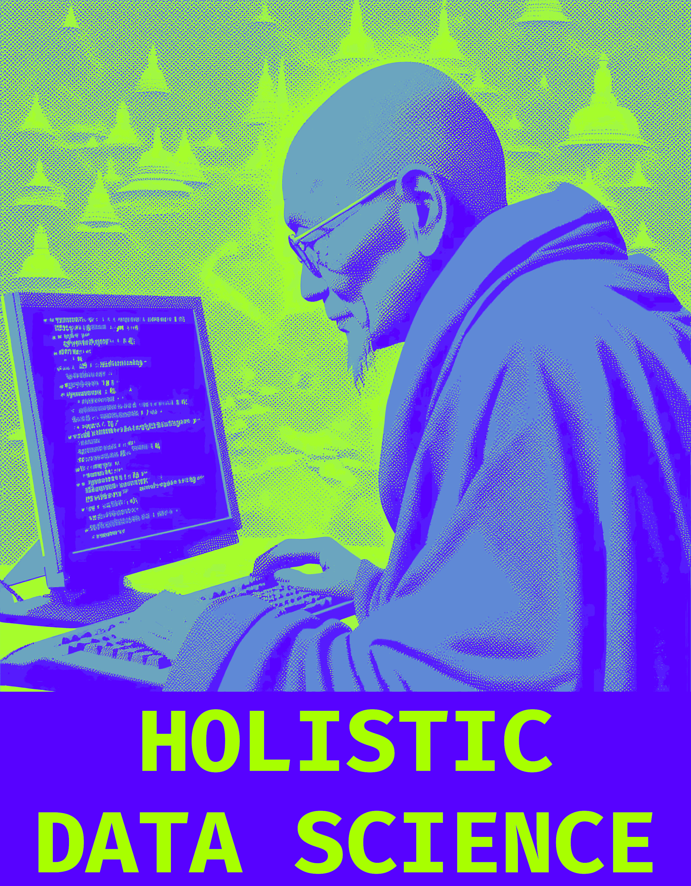

# Personal Portfolio - Django

This is my personal portfolio project developed in Django. You can view the final result [here](https://holisticdatascience.onrender.com/).

## Contents

- [Description](#description)

- [Technologies Used](#technologies-used)

- [Inspirations](#inspirations)

- [Deployment](#deployment)

- [Tools Used](#tools-used)

- [Color Palette and Font](#color-palette-and-font)

## Description

My personal portfolio is developed in Django and consists of several sections, each with its corresponding HTML file:

- Home
- About Me
- Skills
- Portfolio (General)
- Portfolio (Academic)
- Contact
- Frequent Questions
- Blog

Additionally, I've used static CSS files for styles and effects, as well as static JS files to implement effects and behaviors on the site, such as preload, carousel, scroll transitions, and mouse behavior. GSAP has been integrated for menu deployment.

## Technologies Used

- Django
- PostgreSQL (Database)
- HTML
- CSS
- JavaScript
- GSAP

## Inspirations

I drew inspiration from various sites and resources for the design and development of my portfolio, including:

- [CodePen](https://codepen.io/)
- [RedStapler](https://redstapler.co/)
- [Envato Elements](https://elements.envato.com/)
- [Figma Communit](https://www.figma.com/community)
- [Envato Tuts+](https://www.youtube.com/@envatotuts)
- [Jesse Nyberg](https://www.youtube.com/@JesseNyberg)
- [Creative Director Explains](https://www.youtube.com/@CreativeDirectorExplains)
- [Europe Branding Design](https://www.youtube.com/@europebrandingdesign)
- [Codegrid](https://www.youtube.com/@codegrid)
- [Mech Gifs](https://mecha-gifs.tumblr.com/)

## Deployment

The project was deployed on [Render.com](https://render.com/) following tutorials from [FaztCode](https://www.youtube.com/@FaztCode).

## Tools Used

- Adobe Photoshop 2024
- Dall-E 3

## Color Palette and Font

- Colors: #fff, #000, #5700FF, #a8ff00
- Font: Fira Code Mono
